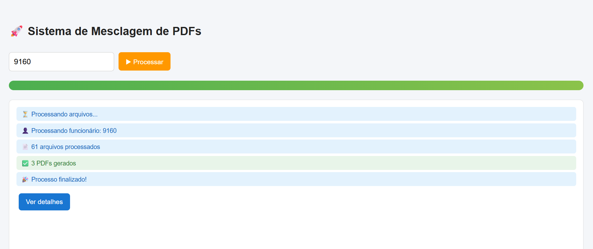
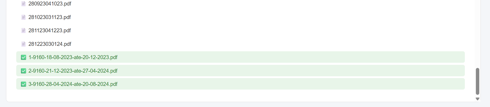

# 📄 Mescla PDF

Sistema web para processamento e mesclagem automática de arquivos PDF por funcionário.

## 📌 Contexto do Projeto

Este projeto foi desenvolvido a partir de uma demanda real dentro do ambiente corporativo.

Já existia uma solução anterior para mesclagem de PDFs, porém apresentava instabilidades relacionadas à organização de pastas e ambiente de servidor, impactando o uso no dia a dia.

Diante disso, desenvolvi uma nova versão do sistema, com foco em:

- Maior confiabilidade no processamento
- Organização padronizada de arquivos
- Melhor controle e visualização do processo
- Facilidade de manutenção e evolução

O objetivo foi criar uma solução mais estável, simples e eficiente para atender às necessidades da empresa.

## 🚀 Funcionalidades

- 📂 Leitura automática de arquivos PDF
- 📅 Ordenação por data baseada no nome do arquivo
- 📦 Agrupamento de PDFs por tamanho
- 📄 Geração de arquivos PDF mesclados
- 📊 Interface com log e resumo do processamento

## 🖥️ Demonstração

O usuário informa o código do funcionário e o sistema realiza automaticamente:
1. Lê os PDFs da pasta
2. Organiza por data
3. Agrupa por tamanho
4. Gera arquivos finais automaticamente

## 🛠️ Tecnologias utilizadas

- PHP
- JavaScript (AJAX)
- HTML5
- CSS3

## ⚙️ Como utilizar

1. Organize os arquivos PDF no seguinte formato:

- Colar os PDF's na pasta Originais
- Renomear a pasta na raiz do projeto com o código do colaborador

2. Acesse no navegador:

http://localhost/mescla-pdf/painel.php

3. Informe o código do funcionário e clique em **Processar**

---

## ⚠️ Observações

- Os arquivos PDF não são versionados no repositório
- O sistema utiliza o PDFtk para realizar a mesclagem dos arquivos

## 👨‍💻 Autor

Desenvolvido por Matheus Baptista
